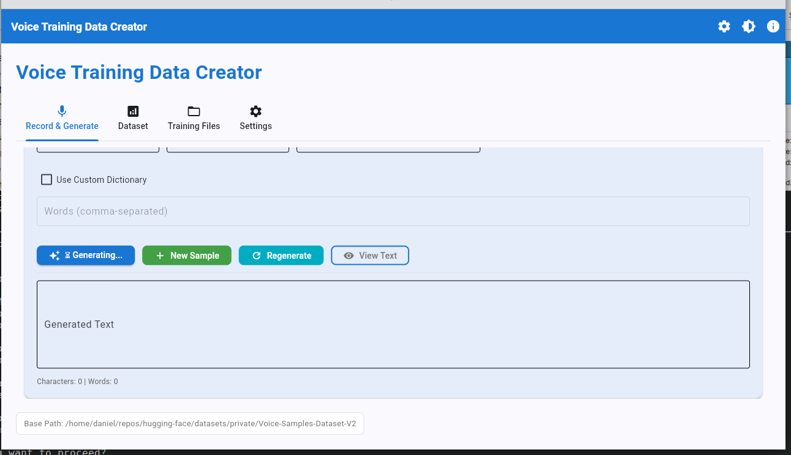
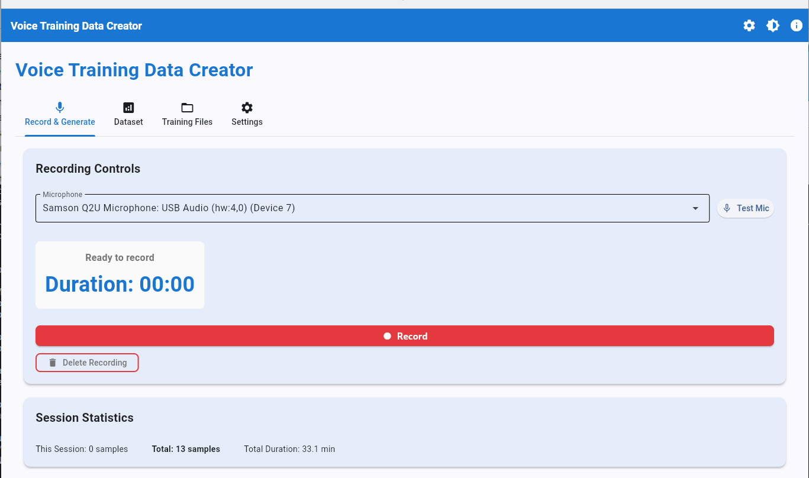
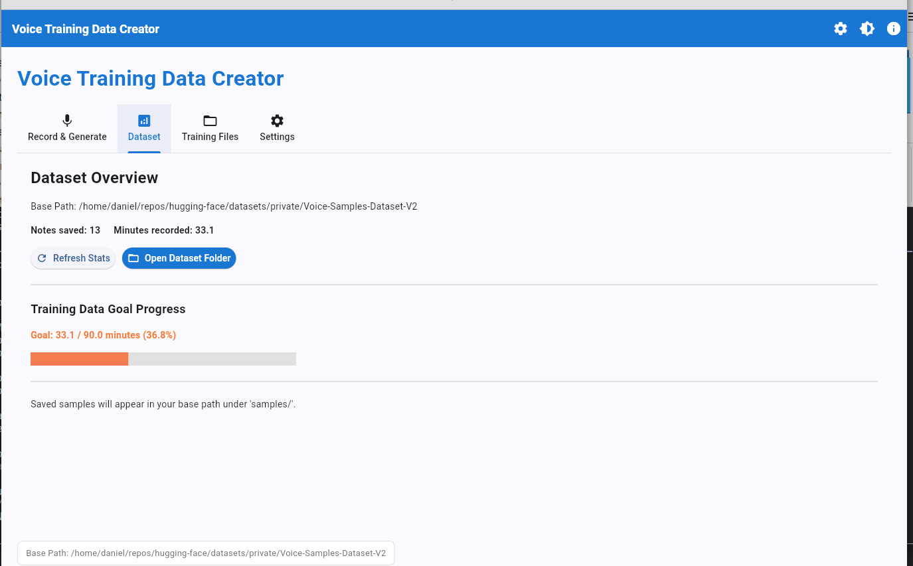
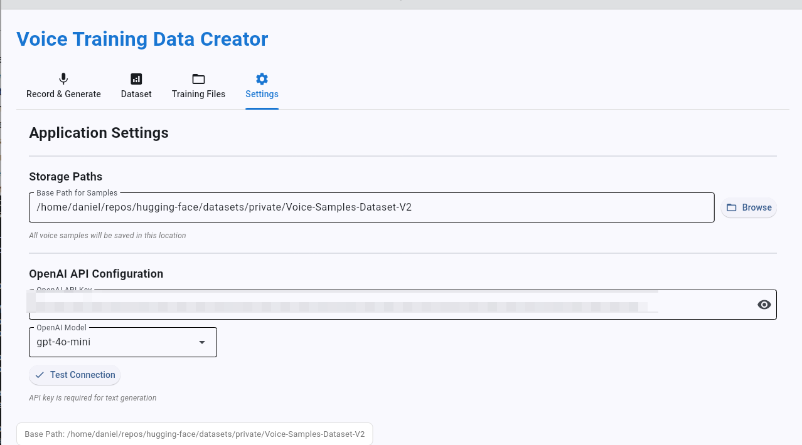

# Voice Training Data Creator




A desktop GUI application for creating voice training datasets with AI-powered synthetic text generation. Supports voice cloning, TTS model training, and STT fine-tuning workflows.

## Screenshots







 
## Dataset System

Each sample is saved as a numbered folder (starting from 001) with:

- Recording (as .wav)
- Text as .txt, incorporating user edits to scrub AI messages from source of truth
- JSON for metadata

## Features

### Audio Recording
- High-quality WAV recording (44.1kHz/48kHz, 16-bit)
- Preferred microphone selection (auto-selected on recording)
- Microphone selection and testing
- Real-time duration tracking
- Pause/resume functionality during recording
- **Retake button**: One-click to discard and restart recording
- Delete recording option

### Text Generation
- Synthetic text generation using OpenAI GPT models
- Multiple style options:
  - General Purpose
  - Colloquial
  - Voice Note
  - Technical
  - Prose
- Custom vocabulary dictionary support
- Configurable duration and speaking rate (WPM)
- Post-generation text editing
- Regenerate option (keep audio, new text)
- **New Sample button**: Clear state and start completely fresh
- Narration view with adjustable font size

### Sample Management
- Organized directory structure (numbered folders)
- Automatic sample numbering
- Metadata tracking (generation parameters, timestamps)
- Session statistics
- Total duration estimation
- **Personalized goal tracking**: Set target duration and track progress
- Quick access to dataset folder

### Configuration and Settings
- **Dedicated Settings Tab** for easy access
- Secure API key storage (system keyring)
- API connection testing
- Preferred microphone configuration
- Configurable audio quality settings (sample rate)
- Multiple OpenAI model support (gpt-4o-mini, gpt-4o, gpt-4.1-mini)
- Persistent base path configuration
- Training goal duration (personalizes progress tracking)
- Auto-generate next sample preference

### User Experience
- Three-tab interface (Record & Generate, Dataset, Settings)
- Light/dark theme toggle
- Helpful tooltips and descriptions
- Real-time statistics updates
- Clear workflow with New Sample and Retake buttons

## Installation

### Option 1: Install .deb Package (Recommended)

Standard installation method for Ubuntu/Debian systems:

1. **Download or build the package**:
   ```bash
   # Option A: Build from source
   git clone https://github.com/danielrosehill/Voice-Training-Data-Creator.git
   cd Voice-Training-Data-Creator
   ./build-deb.sh

   # Option B: Download release (when available)
   # Download voice-training-data-creator_1.0.0_all.deb from releases
   ```

2. **Install the package**:
   ```bash
   sudo dpkg -i voice-training-data-creator_1.0.0_all.deb
   sudo apt-get install -f  # Install dependencies
   ```

3. **Validate installation** (optional):
   ```bash
   ./validate-package.sh
   ```

4. **Launch the application**:
   - From application menu: Search for "Voice Training Data Creator"
   - From terminal: `voice-training-data-creator`

See [INSTALL.md](INSTALL.md) for detailed installation instructions and troubleshooting.

### Option 2: Run from Source

For development or if you prefer not to install system-wide:

#### Prerequisites

- Python 3.10 or higher
- Ubuntu Desktop (tested on Ubuntu 25.04 with KDE)
- System packages: `libportaudio2`
- OpenAI API key (for text generation)

### Setup

1. Clone the repository:
```bash
git clone https://github.com/yourusername/Voice-Training-Data-Creator.git
cd Voice-Training-Data-Creator
```

2. The application uses `uv` for virtual environment management. If you don't have it installed:
```bash
pip install uv
```

3. Create and activate virtual environment, then install dependencies:
```bash
uv venv .venv
source .venv/bin/activate
uv pip install -r requirements.txt
```

## Usage

### Running the Application

Use the provided launcher script:
```bash
./run.sh
```

Or manually:
```bash
source .venv/bin/activate
python src/main.py
```

### First-Time Setup

1. **Open Settings Tab**: Click on the "Settings" tab
2. **Configure Base Path**: Click "Browse" to set a base directory for storing samples
3. **Add API Key**: Enter your OpenAI API key in the API Configuration section
4. **Test Connection**: Click "Test Connection" to verify your API key works
5. **Set Preferred Microphone** (optional): Choose your preferred microphone device
6. **Set Training Goal** (optional): Enter target duration in minutes (e.g., 60 for 1 hour)
7. **Click "Save Settings"**

### Creating Samples

1. **Generate Text** (or use existing):
   - Set target duration (minutes)
   - Choose words per minute (WPM)
   - Select a style
   - Optionally add custom vocabulary
   - Click "Generate Text"
   - Edit if needed, or click "Regenerate" for a new version

2. **Record Audio**:
   - Your preferred microphone is automatically selected
   - Click "Record" to start
   - Use "Pause/Resume" if you need a break
   - Click "Retake" to discard and restart immediately
   - Click "Stop" when finished

3. **Review and Save**:
   - Edit the text if needed
   - Click "View Text" for a large narration view
   - Click "Save Sample" to store your recording

4. **Start Next Sample**:
   - Click "New Sample" to clear everything and start fresh
   - Or enable "Auto-generate next sample" in Settings for automatic workflow

### Workflow Tips

- **New Sample Button**: Clears text and audio, optionally auto-generates new text
- **Retake Button**: While recording, instantly discard and restart (no stop → delete needed)
- **Regenerate Button**: Keep your audio but generate new text with same parameters
- **Auto-generate**: Enable in Settings to automatically generate text after saving
- **Narration View**: Use "View Text" for a large, readable display while recording

## Directory Structure

Samples are organized as follows:

```
{base_path}/
└── samples/
    ├── 001/
    │   ├── 1.wav              # Audio recording
    │   ├── 1.txt              # Source text
    │   └── 1_metadata.json    # Generation parameters
    ├── 002/
    │   ├── 2.wav
    │   ├── 2.txt
    │   └── 2_metadata.json
    └── ...
```

## Configuration

Configuration is stored in `~/.config/VoiceTrainingDataCreator/config.json`

API keys are stored securely in the system keyring.

## Troubleshooting

### No Audio Devices Found
- Ensure your microphone is connected
- Check system audio settings
- Verify permissions for microphone access

### API Connection Fails
- Verify your API key is correct
- Check internet connectivity
- Ensure you have sufficient OpenAI credits

### Audio Clipping Warning
- Reduce microphone input volume in system settings
- Move further from the microphone
- Adjust microphone gain if available

### Long Silence Detected
- Re-record the sample
- Check microphone is not muted
- Verify microphone is selected correctly

## Development

### Project Structure

```
Voice-Training-Data-Creator/
├── src/
│   ├── main.py              # Application entry point
│   ├── audio/               # Audio recording modules
│   │   ├── recorder.py
│   │   └── device_manager.py
│   ├── llm/                 # LLM integration
│   │   ├── generator.py
│   │   └── prompt_builder.py
│   ├── storage/             # Configuration and data storage
│   │   ├── config.py
│   │   └── sample_manager.py
│   ├── main.py              # Flet UI (single-file architecture)
│   └── utils/               # Validation utilities
│       └── validators.py
├── requirements.txt
├── run.sh                   # Launcher script
└── README.md
```

### Dependencies

- **Flet**: Modern GUI framework (Flutter-based)
- **sounddevice**: Audio recording
- **soundfile**: WAV file handling
- **numpy**: Audio processing
- **openai**: LLM text generation
- **keyring**: Secure credential storage

### UI Framework

This application uses **Flet** (Flutter-based) for the GUI, providing:
- Flutter-based rendering with predictable layouts
- Declarative UI architecture
- Better cross-platform support
- Material Design by default
- Three-tab interface for organized workflow

The app was migrated from PyQt6 to Flet to resolve persistent layout issues and provide a more modern user experience.

## License

MIT


